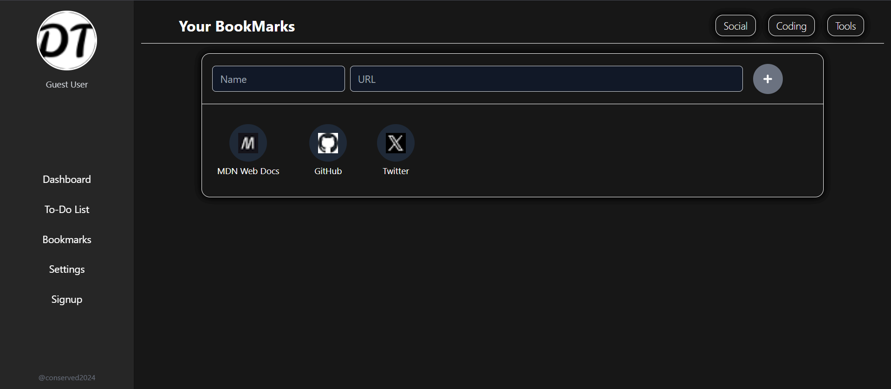
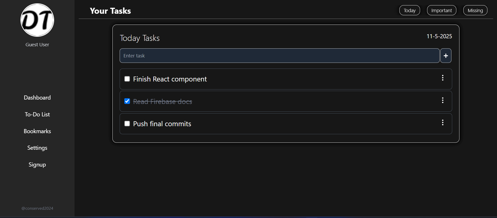
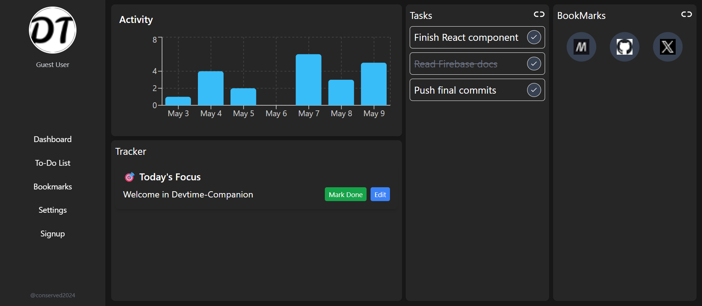
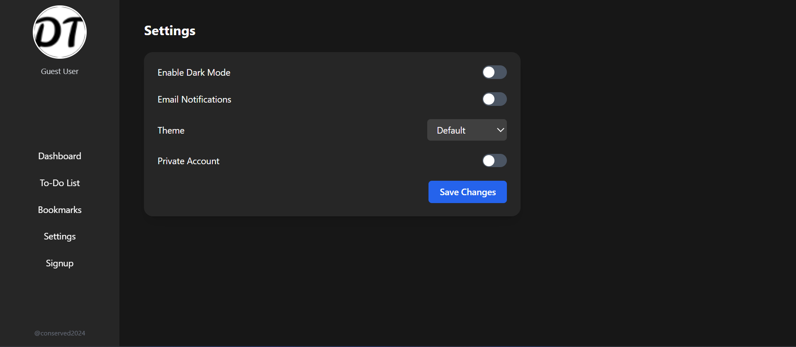
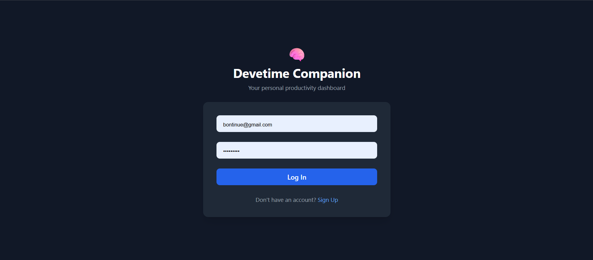
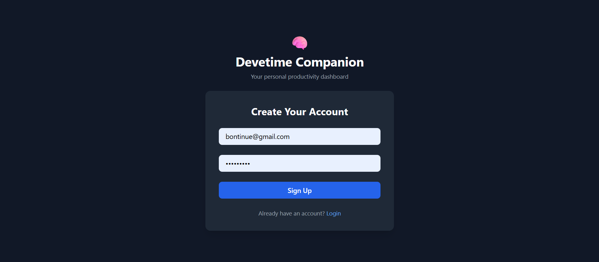

# Devetime Companion

A productivity hub tailored for developers—organize bookmarks, manage todos, and track your productivity with an interactive dashboard—all in one centralized platform.

---

## 📋 Table of Contents

- [Overview](#-overview)  
- [Features](#-features)  
- [Installation](#-installation)  
- [Usage](#-usage)  
- [Tech Stack](#-tech-stack)  
- [Screenshots](#-screenshots)  
- [Contributing](#-contributing)  
- [License](#-license)  
- [Contact](#-contact)  

---

## 🔭 Overview

**Devetime Companion** streamlines a developer's daily workflow by providing a unified platform to manage bookmarks, todos, and productivity insights. Whether you're planning tasks or saving that Stack Overflow gem, everything stays organized and accessible—no more cluttered tabs or lost notes.

---

## ✨ Features

### 🔖 Bookmark Management

- Save development resources with title, URL, tags, and notes  
- Categorize and filter bookmarks by tags  
- Search functionality for quick access  
- View saved bookmarks on the dashboard  

### ✅ Todo Management

- Add, edit, delete tasks with priority and due date  
- Mark tasks as complete or pending  
- Daily planning with categorized task views  
- Visual task completion tracking  

### 📊 Dashboard

- Overview of daily/weekly productivity  
- Charts for task completion rate and app usage  
- Quick links to recently used features  
- Displays saved bookmarks and today's tasks  

### 🧭 Guest Access

- View data without logging in (read-only mode)  
- Login to create, update, or delete todos/bookmarks  

---

## 💻 Installation

```bash
# Clone the repository
git clone https://github.com/yourusername/devtime-companion.git

# Navigate to the project directory
cd devtime-companion

# Install dependencies
npm install

# Start the development server
npm run dev
```

## 🚀 Usage
➕ Adding a Bookmark
Go to the Bookmarks page

Click Add New Bookmark

Fill in the URL, title, optional tags, and notes

Click Save

📝 Creating a Todo
Navigate to the Todos page

Click Add New Todo

Enter task details, priority, and due date

Click Add

📈 Using the Dashboard
Access from the home page after login

View latest bookmarks and tasks

Check activity metrics and completion stats

Use visual charts to understand productivity trends

## 🛠️ Tech Stack
Frontend: React, Tailwind CSS

State Management: Redux Toolkit

Backend/Database: Firebase Firestore

Authentication: Firebase Auth (Email/Password, Guest Access)

Hosting: Firebase Hosting

Charts: Recharts

## 📸 Screenshots
You can include screenshots or GIFs of the Dashboard, Todos page, and Bookmarks page to showcase features visually.
(e.g., /assets/screenshots/dashboard.png)

##  🔗 Bookmarks Page 


### ✅ Todos Page


### 📊 Dashboard View


### 🛠️ Settings Page 


### 👩🏻‍🎤 Login Page


### 👩🏻‍🎤 Signup Page


## 👥 Contributing
Contributions are welcome! Please feel free to fork and submit a Pull Request.


# Fork the repository
# Create your feature branch
git checkout -b feature/amazing-feature

# Commit your changes
git commit -m 'Add some amazing feature'

# Push to the branch
git push origin feature/amazing-feature

# Open a Pull Request
📄 License
This project is licensed under the MIT License – see the LICENSE file for details.

## 📞 Contact
Harsh – onlybelieveharsh@gmail.com

Project Link: https://github.com/yourusername/devtime-companion